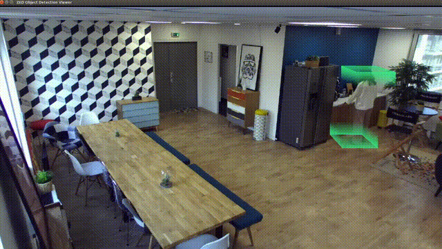

# 3D Object Detection Viewer with ZED SDK

This sample shows how to detect and track objects in space and display it. It demonstrates how to:

- Detect and track objects in the scene using the ZED SDK API
- Show the image with 3D bounding box in a similar way than ZED Unity Plugin but with OpenGL.

## Getting started

- First, download the latest version of the ZED SDK on [stereolabs.com](https://www.stereolabs.com).
- For more information, read the ZED [API documentation](https://www.stereolabs.com/developers/documentation/API/).

*NOTE:* A ZED 2 is required to run use this module.

### Prerequisites

- Windows 10, Ubuntu LTS
- [ZED SDK](https://www.stereolabs.com/developers/) and its dependencies ([CUDA](https://developer.nvidia.com/cuda-downloads))
- OpenCV

## Build the program

#### Build for Windows

- Create a "build" folder in the source folder
- Open cmake-gui and select the source and build folders
- Generate the Visual Studio `Win64` solution
- Open the resulting solution and change configuration to `Release`
- Build solution

#### Build for Linux

Open a terminal in the sample directory and execute the following command:

- mkdir build
- cd build
- cmake ..
- make

## Run the program

- Navigate to the build directory and launch the executable
- Or open a terminal in the build directory and run the sample :

      ./ZED_Object_Detection_Viewer <optional-parameters>

      * <optional-parameters> can be a resolution for example HD2K : `./ZED_Object_Detection_Viewer HD2K`
      * <optional-parameters> can be a SVO file for example : `./ZED_Object_Detection_Viewer path_to_svo.svo`
      * <optional-parameters> can be a IP stream input for example : `./ZED_Object_Detection_Viewer <ip>` where ip is the sender IP (Use Camera\ Streaming/Sender)

## Overview

## Options
`#define WITH_TRAJECTORIES` in GLViewer.hpp --> Add 3D trajectories view
`#define SOCIAL_DISTANCE_DETECTION` in GLViewer.hpp --> example of use (sadly due to the whole situation on 2020...) : See if social distance are respected and show a warning. 

